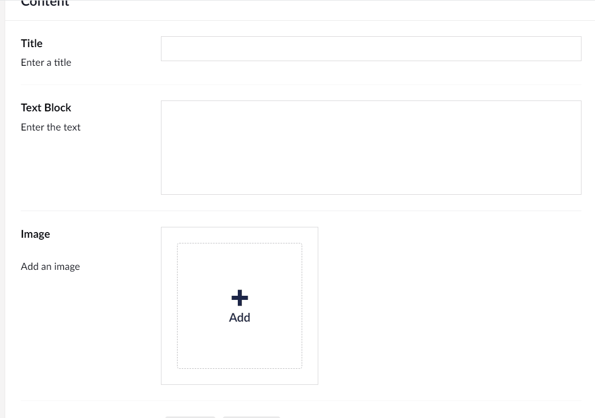

# Pace Convertion Extension Method
This extension method converts an input pace in to min/km or min/mi

>[!NOTE]
> This code used accepts an IHTMLEncodedString which is an Umbraco CMS specific type, however, the code can be modified
> to accept a plain string without too much effort

If you have a Rich Text Editor or a simple text input field that allows you to type in a pace, this extension method can convert the pace for you. 

An example is below: 

In your text input field, you can enter either minutes per kilometre pace `{{6:00}}` or minutes per mile `{{6:00,mi}}` and the output includes your original pace along side the converted pace. 

## How to use

Add this extension method to your project and then when you normally output your text, you add `.ConvertPace()` to the end.
e.g. `Model.TextBlock.ConvertPace()`

The method then looks for the patter `{{}}` or `{{,mi}}` and outputs the pace entered but also the converted pace. 